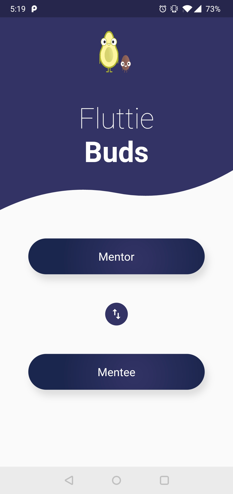
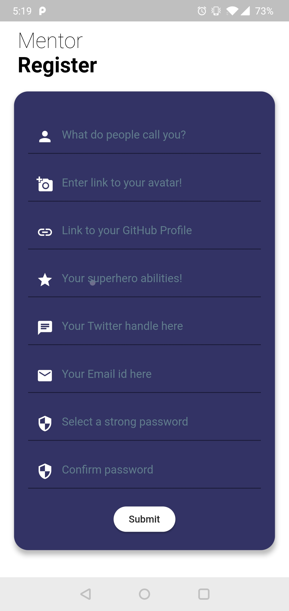
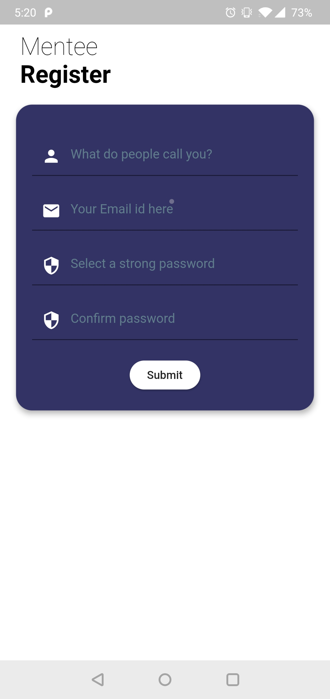
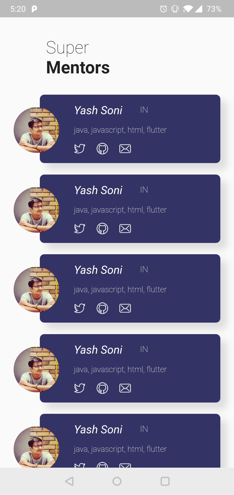

# Flutter International Hackathon - 2019

## Oragnised by MavenHive, Bangalore

## Introduction

Fluttie buds is an Open Source platform that connects Mentors and Mentees.
This will help Flutter community connnect with each other - learn & grow, together!

End users:

1. Mentor:
	A mentor can register/sign-in with the App, mention the skills they are more confortable with, add their communication handles, link an avatar, etc. 
2. Mentee:
	A mentee will be able to register_sign-in to the App. He_She can further lookup on the existing mentors, and based on matching skills - they can communicate with them directly through their preferred medium.
	

- Screenshots:
	

- Developed by:
 - Sangeet Manghnani (sangeet.manghnani@gmail.com)
 - Yash Soni (ysoni96@gmail.com)